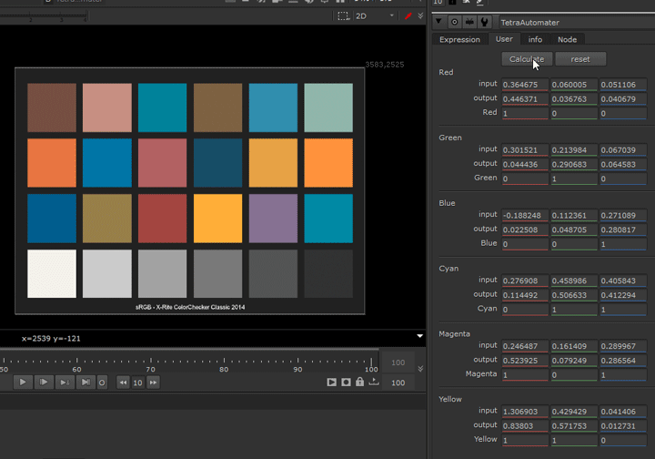

# Tetrahedral Interpolation

Color transformations using tetrahedral interpolation, includes both an implemention for the expression node and blinkscript.
I never managed to solve an inverse function for this to round trip back, which is something I came really close to but eventually scrapped. So for now only a simple forward operation.

Video demonstration: https://www.youtube.com/watch?v=8kBkYEiAkIw

NEW: Check out a port made for Fusion by Ember Light https://github.com/EmberLightVFX/Tetrahedral-Interpolation-for-Fusion

## TetraAutomater

As the name suggests, matches the 6 colors automatically, given an input and output. Can also be used for an inverse operation but not recommended. The python library SymPy will be required (found SymPy==1.5 to work correctly, newer versions seem to cause issues due to some change to how the solver works).

Originally written for matlab by [Juanjo Salazar](https://www.juanjosalazar.com/), solution was later translated to python by [Ethan Ou](https://github.com/ethan-ou/).

## Papers and Resources
- http://www.yedlin.net/DisplayPrepDemo/DispPrepDemoFollowup.html
- https://www.filmlight.ltd.uk/pdf/whitepapers/FL-TL-TN-0057-SoftwareLib.pdf
- https://blogs.mathworks.com/steve/2006/11/24/tetrahedral-interpolation-for-colorspace-conversion/
- https://www.hpl.hp.com/techreports/98/HPL-98-95.pdf
